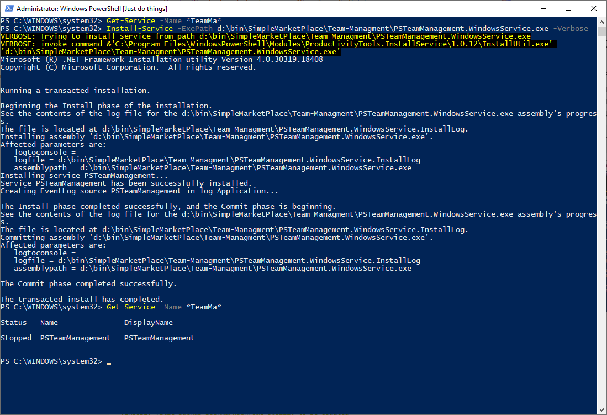
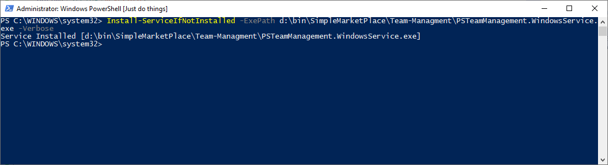
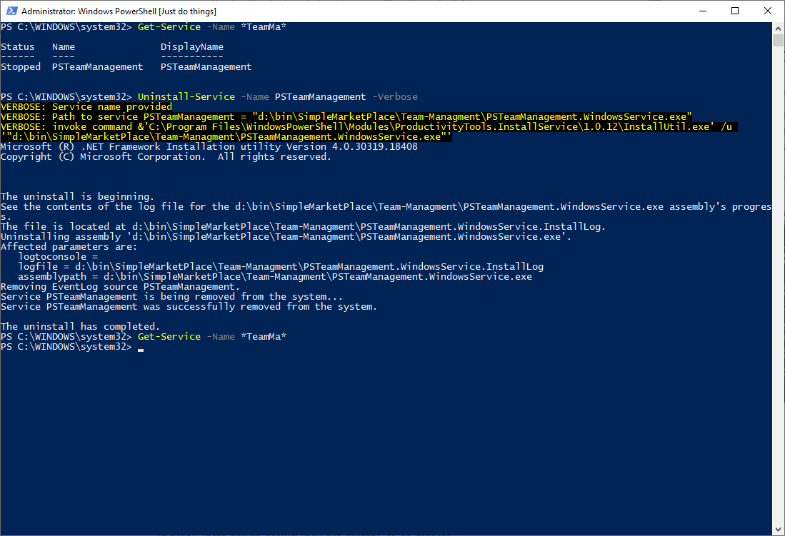

<!--Category:PowerShell--> 
 <p align="right">
    <a href="https://www.powershellgallery.com/packages/ProductivityTools.InstallService/"></a>
    <a href="http://productivitytools.tech/install-service/"><a> 
    <a href="https://github.com/pwujczyk/ProductivityTools.InstallService/"></a>
</p>
<p align="center">
    <a href="http://http://productivitytools.tech/">
        
    </a>
</p>

# Install Service

Install service is a wrapper around InstallUtil.exe file. It exposes three functions:

<!--more-->
- Install-Service – it invokes InstallUtil.exe pathToExecutable command
- Install-ServiceIfNotInstalled – first it checks if service is installed if not perform the method Install-Service
- Uninstall-Service – it uninstalls service. ServiceName of path to executable can be used.

```PowerShell
Install-Service -ExePath d:\bin\SimpleMarketPlace\Team-Managment\PSTeamManagement.WindowsService.exe -Verbose
```
<!--og-image-->



```PowerShell
Install-ServiceIfNotInstalled -ExePath d:\bin\SimpleMarketPlace\Team-Managment\PSTeamManagement.WindowsService.exe -Verbose
```




```PowerShell
Uninstall-Service -Name PSTeamManagement -Verbose
```




